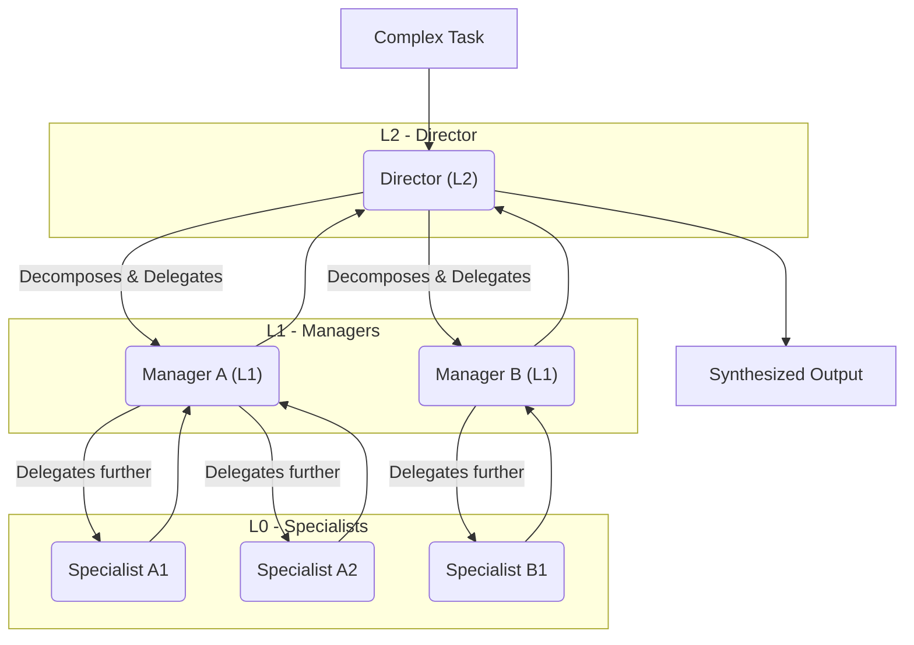
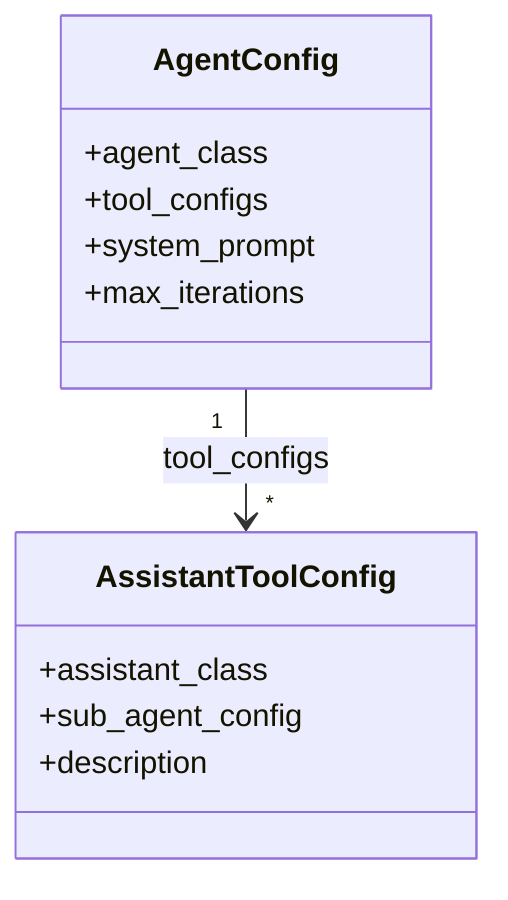
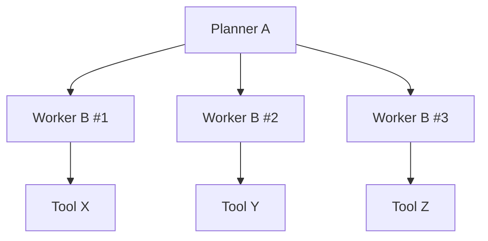

# HiveMind / AgentHive 🐝

[](https://opensource.org/licenses/Apache-2.0)
[](https://www.python.org/downloads/)
[Read this document in Chinese](./README.md)

**HiveMind (a.k.a. AgentHive): A framework for hierarchical multi-agent collaboration, built for complex tasks.**  
This repository now focuses purely on the framework itself; concrete application blueprints are expected to live in your own projects.

When a single agent hits a wall, AgentHive lets you build, orchestrate, and scale a dynamic team of AI agents that work together in an organized, hierarchical structure.

---

## 🌟 Core Vision: The Tree of Agents (ToA)

AgentHive's core philosophy is **organization conquers complexity**. Instead of creating a single, monolithic "super-agent," we build a structured, predictable, and hierarchical team of specialists.

This team takes the form of a **Tree of Agents (ToA)**:

*   **The Root**: A high-level agent receives the initial, complex task.
*   **The Branches**: It decomposes the task and dynamically creates "sub-agents" or "sub-teams" to handle more specific sub-tasks.
*   **The Leaves**: The lowest-level agents are executors, focused on solving a single, well-defined problem.

This process can be infinitely recursive, forming an organizational structure whose depth and breadth are defined at **runtime** by the task itself.



## ✨ Framework Highlights

The framework is built around a small set of composable primitives:

1.  **`BaseAgent` (The Agent)**: The fundamental worker unit. An LLM-powered decision-maker that thinks, selects tools, and executes using a JSON schema (`thought / action / action_input / status`).
2.  **`ExecutableTool` (The Tool)**: A concrete capability an agent can invoke, declared via JSON-Schema-style `parameters`. Any Python function can be wrapped as a tool.
3.  **`AgentConfig` (The Blueprint)**: A declarative configuration describing an agent class, its tools, system prompt, and iteration cap.
4.  **`AssistantToolConfig` (The Delegator Tool)**: Wraps a `sub_agent_config` as a tool so a parent agent can spawn and delegate work to child agents at runtime.
5.  **`FlexibleContext` & `HistoryStrategy`**: Shared context and pluggable conversation-history policies (e.g., keep last N messages, compact large tool outputs).

An agent becomes a manager by using a delegator tool. This is how the Tree of Agents grows.

## 🧱 Core Modules

- `src/hivemind/base.py`
  - `BaseLLM` / `JSONOutputLLM`: handle JSON-formatted LLM requests/responses.
  - `BaseAgent`: ReAct-style multi-step loop with tool calls, background jobs, and streaming.
- `src/hivemind/tools/basetool.py`
  - `ExecutableTool`: base class for all tools, with `name / description / parameters / execute`.
  - `FlexibleContext`: a lightweight container to share state between agents and tools (supports deep/shallow copy).
- `src/hivemind/core/builder.py`
  - `AgentConfig`: declarative blueprint for a single agent instance.
  - `AssistantToolConfig`: wraps a sub-agent configuration as a delegator tool.
  - `build_agent` / `build_assistant`: construct runnable agents and assistants from configs.
- `src/hivemind/core/assistants.py`
  - `BaseAssistant`: serial delegator (one sub-task at a time).
  - `ParallelBaseAssistant`: parallel delegator (fan-out to multiple child agents).
- `src/hivemind/llmclient.py`
  - `LLMClient`: provider-agnostic client (OpenAI, DeepSeek, Aliyun, etc.), auto-selecting text vs vision models based on messages and reading settings from `config.ini` + environment variables.
- `src/hivemind/historystrategy.py`
  - `HistoryStrategy` and concrete strategies like `KeepLastN`, `CompactToolHistory`, etc., to manage context window usage.

## ⚙️ Installation & Configuration

```bash
git clone https://github.com/z-zsstar/HiveMind.git
cd HiveMind

python -m venv .venv
source .venv/bin/activate  # On Windows: .venv\Scripts\activate

pip install -r requirements.txt
cp config.ini.template config.ini  # Fill in provider API keys
```

Configuration notes:

- By default `LLMClient` loads from `config.ini` at the project root, and falls back to environment variables such as `OPENAI_API_KEY`, `DEEPSEEK_API_KEY`, etc.
- Use the `[common]` section to choose default `active_model` / `active_vision_model`, and provider-specific sections to configure `model`, `base_url`, `temperature`, and so on.

Quick connectivity check:

```bash
PYTHONPATH=src python -m hivemind.llmclient
```

## 🐣 Minimal Example: Single Agent + Custom Tool

The following snippet shows how to wrap a plain Python function as a tool and let `BaseAgent` orchestrate it:

```python
from hivemind.base import BaseAgent
from hivemind.tools.basetool import ExecutableTool, FlexibleContext

class EchoTool(ExecutableTool):
    name = "echo"
    description = "Echo a piece of text with a prefix."
    parameters = {
        "type": "object",
        "properties": {
            "text": {"type": "string", "description": "Content to echo"}
        },
        "required": ["text"],
    }

    def execute(self, text: str) -> str:
        return f"[Echo]: {text}"

context = FlexibleContext(output="outputs")
agent = BaseAgent(
    context=context,
    tools=[EchoTool],
    system_prompt="You are an assistant that uses tools to solve problems."
)

result = agent.run("Please use the echo tool to process this sentence: Hello, HiveMind.")
print(result)
```

The LLM receives a system prompt that includes the `echo` tool definition and must respond with JSON. `BaseAgent` parses the response, invokes `echo` when `action == "echo"`, and stops when `action == "finish"` and `status == "complete"`.

## 🔁 Event-Loop Agent Mode

`BaseAgent.run` / `BaseAgent.arun` implement an internal event loop that coordinates LLM decisions, tool calls, and background tasks:

1. Build the system + history messages (optionally processed by a `HistoryStrategy`) and call `LLMClient`.
2. Parse the JSON reply into `thought / action / action_input / status`.
3. Branch on `action`:
   - `action == "finish"`: if `status == "complete"` and no background tasks are running, return the `final_response` and exit;
   - `action` is the name of a tool: call `_execute_tool` (sync) or `_execute_tool_async` (async) and append the result back into the message history;
   - `action == "wait"`: enter a waiting mode where the loop only checks background tasks and injects their results, without calling the LLM again.
4. Stop when either a valid `finish` is observed or `max_iterations` is reached.

### Background Tasks and the `wait` Action

You can mark certain tools as background tools (e.g., long-running analysis):

```python
from hivemind.tools.basetool import ExecutableTool

class LongJobTool(ExecutableTool):
    name = "long_job"
    description = "Perform a long-running analysis job."
    parameters = {"type": "object", "properties": {}, "required": []}
    is_background_task = True  # key flag

    def execute(self) -> str:
        ...
        return "long job result"
```

When the LLM returns `{"action": "long_job", "status": "continue"}`:

- `BaseAgent` starts the tool in a background thread or coroutine, and injects a `background_tool_result` (or error) message once it completes;
- if the LLM later responds with `{"action": "wait", "status": "continue"}`, the event loop temporarily stops calling the LLM and only polls background tasks, injecting their results as they finish and resuming normal decision-making afterwards.

This lets agents follow a pattern of “fire off expensive work → continue doing other planning → react when results arrive”, instead of blocking on a single step.

### Streaming Observability: `stream` / `astream`

- `stream(user_input)` / `astream(user_input)` return a list of structured events (system/user/assistant/tool_call/tool_result/background_tool_result, etc.), which is ideal for building UIs or debugging complex ToA runs.
- Compared to `run`/`arun`, the streaming APIs are focused on observability: you see every decision and tool call as a first-class event.

## Blueprint Examples (A/B/C)

This section uses abstract nodes A, B, C to explain how to assemble blueprints with `AgentConfig` and `AssistantToolConfig` and what the runtime Tree-of-Agents (ToA) looks like when executing. The examples are generic and not tied to any specific domain.

Key API
- `hivemind/core/builder.py`:
  - `AgentConfig`: defines an agent (its class, tools, system prompt, iteration cap)
  - `AssistantToolConfig`: wraps a sub-agent so the parent can delegate work to it
- `hivemind/core/assistants.py`:
  - `BaseAssistant`: serial delegation helper
  - `ParallelBaseAssistant`: parallel delegation helper

In the examples below, we assume you have defined two concrete agent classes in your own codebase:

- `PlannerAgent` (acts as A: planner/manager)
.- `WorkerAgent` (acts as B/C: worker/executor)

Blueprint Core (rendered)



### Two-Layer Dynamic ToA (A → B)

Intent: A delegates tasks to B; B is terminal (only tools, no further delegation).

```python
from hivemind.core.builder import AgentConfig, AssistantToolConfig, build_agent
from hivemind.core.assistants import BaseAssistant
from hivemind.tools.basetool import FlexibleContext

from your_project.agents import PlannerAgent, WorkerAgent      # A, B
from your_project.tools import DEFAULT_WORKER_TOOL_CLASSES     # Tools for B

# B: terminal worker. Only tools, no assistants.
B_cfg = AgentConfig(
    agent_class=WorkerAgent,
    tool_configs=[*DEFAULT_WORKER_TOOL_CLASSES],
    system_prompt="B: Execute sub-tasks with available tools.",
    max_iterations=50,
)

# A: planner that can delegate to B via a BaseAssistant tool
A_cfg = AgentConfig(
    agent_class=PlannerAgent,
    tool_configs=[
        AssistantToolConfig(
            assistant_class=BaseAssistant,
            sub_agent_config=B_cfg,
            description="Delegate a sub-task to worker B and wait for result.",
        )
    ],
    system_prompt="A: Plan tasks; delegate to B for execution.",
    max_iterations=50,
)

# Build the root agent at runtime and execute
root_ctx = FlexibleContext(output="outputs")
root_agent = build_agent(A_cfg, context=root_ctx)
final_answer = root_agent.run("Please analyse a complex task and break it down into actionable steps.")
```

Runtime ToA effect (example execution):



- A decides sub-tasks and repeatedly invokes the assistant to spin up B instances (serially). Each B runs to completion and returns results to A.

### Three-Layer Dynamic ToA (A → B → C)

Intent: A delegates to B (coordinator for a scope), and B further delegates specific units of work to C workers.

```python
from hivemind.core.builder import AgentConfig, AssistantToolConfig, build_agent
from hivemind.core.assistants import BaseAssistant, ParallelBaseAssistant
from hivemind.tools.basetool import FlexibleContext

from your_project.agents import PlannerAgent, WorkerAgent      # A, B/C
from your_project.tools import DEFAULT_WORKER_TOOL_CLASSES

# C: terminal workers for fine-grained tasks
C_cfg = AgentConfig(
    agent_class=WorkerAgent,
    tool_configs=[*DEFAULT_WORKER_TOOL_CLASSES],
    system_prompt="C: Execute granular unit of work.",
    max_iterations=40,
)

# B: mid-level coordinator that may spawn multiple C in parallel for speed
B_cfg = AgentConfig(
    agent_class=WorkerAgent,
    tool_configs=[
        AssistantToolConfig(
            assistant_class=ParallelBaseAssistant,
            sub_agent_config=C_cfg,
            description="Fan-out to multiple C workers for parallel execution.",
        )
    ],
    system_prompt="B: Partition work; fan-out to C.",
    max_iterations=50,
)

# A: top planner that delegates a large scope to B
A_cfg = AgentConfig(
    agent_class=PlannerAgent,
    tool_configs=[
        AssistantToolConfig(
            assistant_class=BaseAssistant,
            sub_agent_config=B_cfg,
            description="Delegate scoped task to coordinator B.",
        )
    ],
    system_prompt="A: High-level planning and orchestration.",
    max_iterations=50,
)

ctx = FlexibleContext(output="outputs")
root = build_agent(A_cfg, context=ctx)
answer = root.run("Please perform layered planning and analysis of a large problem.")
```

Runtime ToA effect (example execution):


- A defines scopes and delegates them to B.
- Each B partitions its scope and uses `ParallelBaseAssistant` to spawn several C workers concurrently, then aggregates their results.

Tips
- Replace `BaseAssistant` with `ParallelBaseAssistant` at A-level to parallelize B as well (A fan-out across scopes).
- Even though the ToA is built at runtime, the blueprint guarantees predictable behaviour: `AgentConfig` and `AssistantToolConfig` fully describe each node's capabilities, tools, and prompts; dynamic aspects are limited to fan-out counts and inputs.

## 📁 Repository Analysis Blueprint Example

As a more concrete blueprint, consider a **repository analysis agent**:

- A (planner) reasons about the entire repo and defines directory-level scopes;
- B (coordinator) owns one directory scope and breaks it into file-level units;
- C (worker) inspects a single file and reports findings.

First, define two simple agent classes based on `BaseAgent` that only customise the `system_prompt`:

```python
# your_project/agents.py
from hivemind.base import BaseAgent

class PlannerAgent(BaseAgent):
    def __init__(self, *args, **kwargs):
        kwargs.setdefault(
            "system_prompt",
            "You are the top-level planner for repository analysis. "
            "You decompose the task and delegate to sub-agents and tools."
        )
        super().__init__(*args, **kwargs)

class WorkerAgent(BaseAgent):
    def __init__(self, *args, **kwargs):
        kwargs.setdefault(
            "system_prompt",
            "You are an executor. Use tools to analyse the given sub-task."
        )
        super().__init__(*args, **kwargs)
```

Then create two basic tools: list code files and read a single file:

```python
# your_project/tools.py
import os
from hivemind.tools.basetool import ExecutableTool

class ListFilesTool(ExecutableTool):
    name = "list_files"
    description = "List code files under a given directory."
    parameters = {
        "type": "object",
        "properties": {"root": {"type": "string"}},
        "required": ["root"],
    }

    def execute(self, root: str) -> str:
        paths = []
        for d, _, fs in os.walk(root):
            for f in fs:
                if f.endswith((".py", ".md")):
                    paths.append(os.path.join(d, f))
        return "\n".join(paths)

class ReadFileTool(ExecutableTool):
    name = "read_file"
    description = "Read the content of a single file."
    parameters = {
        "type": "object",
        "properties": {"path": {"type": "string"}},
        "required": ["path"],
    }

    def execute(self, path: str) -> str:
        with open(path, "r", encoding="utf-8") as f:
            return f.read()

DEFAULT_WORKER_TOOL_CLASSES = [ReadFileTool]
```

Finally, wire them together with an A/B/C blueprint:

```python
# your_project/blueprints_repo_analysis.py
from hivemind.core.builder import AgentConfig, AssistantToolConfig, build_agent
from hivemind.core.assistants import BaseAssistant, ParallelBaseAssistant
from hivemind.tools.basetool import FlexibleContext

from your_project.agents import PlannerAgent, WorkerAgent
from your_project.tools import ListFilesTool, DEFAULT_WORKER_TOOL_CLASSES

# C: file-level workers
C_cfg = AgentConfig(
    agent_class=WorkerAgent,
    tool_configs=[*DEFAULT_WORKER_TOOL_CLASSES],
    system_prompt="C: You receive a single file path and analyse it according to the task.",
    max_iterations=30,
)

# B: directory-level coordinators, fan-out to multiple C
B_cfg = AgentConfig(
    agent_class=WorkerAgent,
    tool_configs=[
        AssistantToolConfig(
            assistant_class=ParallelBaseAssistant,
            sub_agent_config=C_cfg,
            description="For a directory, create multiple C workers to analyse files in parallel.",
        )
    ],
    system_prompt="B: You own a directory scope and further decompose it into file-level tasks.",
    max_iterations=40,
)

# A: top-level planner, uses tools to discover files and delegate directories to B
A_cfg = AgentConfig(
    agent_class=PlannerAgent,
    tool_configs=[
        ListFilesTool,
        AssistantToolConfig(
            assistant_class=BaseAssistant,
            sub_agent_config=B_cfg,
            description="For each directory, create a B coordinator responsible for that scope.",
        ),
    ],
    system_prompt=(
        "A: Plan the overall repository analysis strategy. "
        "Use tools to discover files, group them by directory, and delegate scopes to B."
    ),
    max_iterations=50,
)

def create_repo_analysis_agent(repo_root: str = "."):
    ctx = FlexibleContext(output="outputs", repo_root=repo_root)
    return build_agent(A_cfg, context=ctx)
```

Usage example:

```python
from your_project.blueprints_repo_analysis import create_repo_analysis_agent

agent = create_repo_analysis_agent(repo_root=".")
answer = agent.run(
    "Please describe the high-level architecture of this repository and the responsibilities "
    "of the core modules."
)
print(answer)
```

At runtime, the ToA has the same three-layer shape as in the A → B → C example, but the roles are grounded in a practical scenario: repository → directories → files.

## 🤝 Contributing

We warmly welcome contributions of all kinds! Whether it's fixing a bug, developing a new feature, or improving the documentation, your help is crucial. Please feel free to open an Issue or a Pull Request.

## 📄 License

This project is licensed under the [Apache License 2.0](LICENSE).
