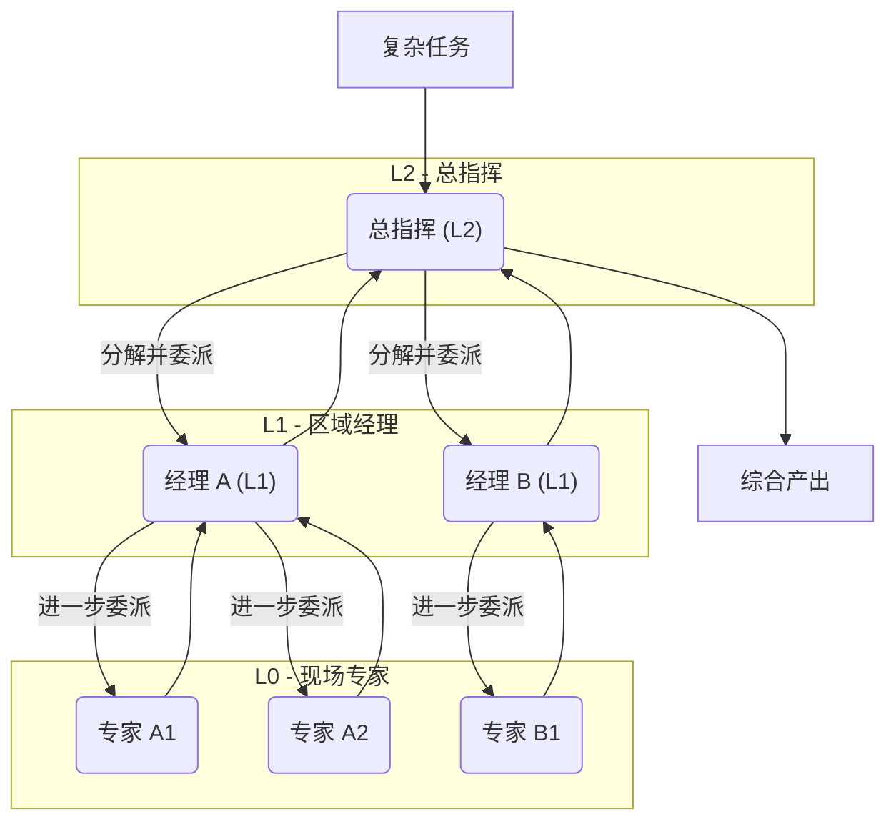
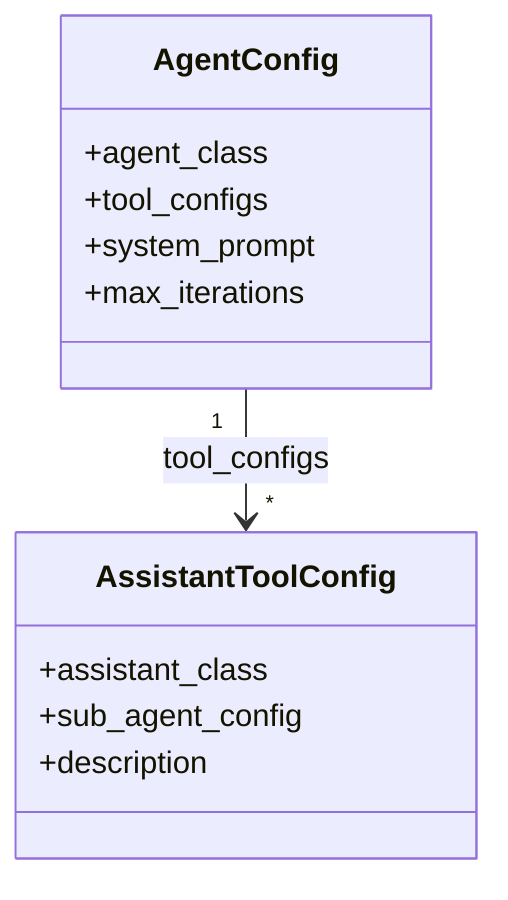
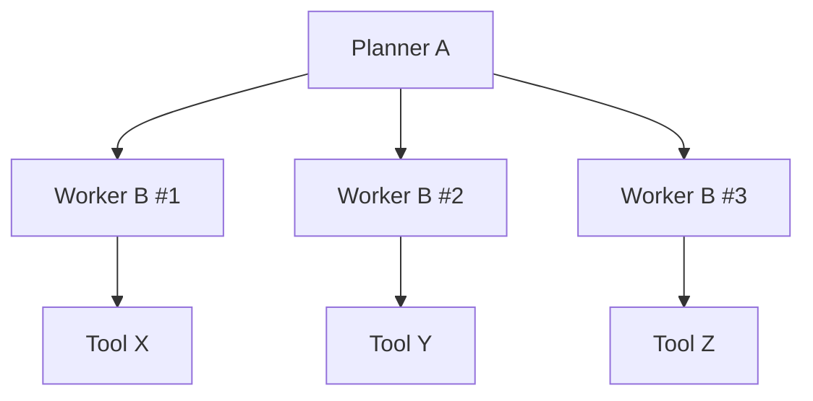
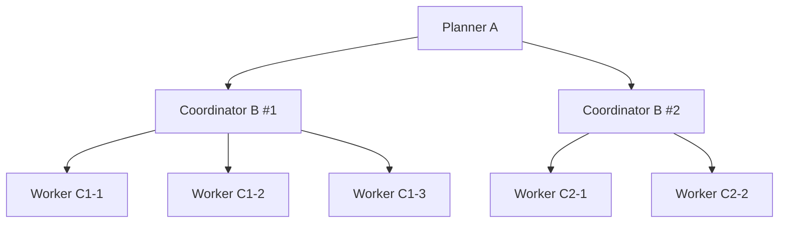

# HiveMind 🐝

[](https://opensource.org/licenses/Apache-2.0)
[](https://www.python.org/downloads/)
[Read this document in English](./README_EN.md)

**HiveMind: 一个为复杂任务而生的、具备层级协作能力的多智能体框架。**  
它专注于「如何组织一群 LLM 智能体协同工作」，而不是提供固定业务应用。

当单个智能体在复杂问题面前束手无策时，HiveMind 允许您构建、编排并扩展一个由 AI 智能体组成的、能够动态组织的“专家团队”。

---

## 🌟 核心愿景：构建智能体之树 (Tree of Agents)

HiveMind 的核心思想是**用组织的力量战胜复杂性**。我们不追求创造一个无所不能的“超级智能体”，而是构建一个结构化的、可预测的、能够分层协作的智能体团队。

这个团队的形态就是一棵**智能体之樹 (ToA)**：

*   **树根 (Root)**：一个高阶智能体接收初始任务。
*   **树枝 (Branches)**：它将任务分解，并动态地创建“子智能体”或“子团队”来处理更具体的子任务。
*   **树叶 (Leaves)**：底层的执行者智能体专注于解决单一、明确的问题。

这个过程可以无限递归，形成一个深度和广度都由任务本身决定的、在**运行时动态生成**的组织结构。



## ✨ 框架特点概览

- **层级多智能体协作**：通过“智能体之树 (Tree of Agents)”组织复杂任务，支持多层管理者/执行者角色。
- **工具驱动推理循环**：`BaseAgent` 使用 JSON 协议输出 `thought / action / action_input / status`，自动选择工具、等待后台任务或结束对话。
- **可插拔工具系统**：基于 `ExecutableTool` 抽象，任何 Python 函数都可以包装成工具，并在 Prompt 中以 JSON-Schema 形式暴露给 LLM。
- **蓝图式编排**：使用 `AgentConfig` 和 `AssistantToolConfig` 声明式定义智能体角色与委派关系，再通过 `build_agent` 组装运行时拓扑。
- **同步 + 异步执行**：同时支持阻塞 (`run`) 与异步 (`arun`) 调用，并内置后台任务 / 后台工具执行机制。
- **可控上下文与记忆**：通过 `FlexibleContext` 共享跨智能体的数据，通过 `HistoryStrategy` 控制对话窗口（截断工具结果、只保留最近消息等）。

## 💡 核心组件与目录结构

魔法来源于几个简单的核心组件：

* `src/hivemind/base.py`
  * `BaseLLM` / `JSONOutputLLM`：封装与 LLM 的 JSON 协议交互与解析。
  * `BaseAgent`：实现 ReAct 风格的多轮工具调用循环、后台任务以及流式输出。
* `src/hivemind/tools/basetool.py`
  * `ExecutableTool`：所有工具的基类，定义 `name / description / parameters / execute` 等接口。
  * `FlexibleContext`：在智能体与工具之间共享状态的轻量级上下文容器（支持深/浅拷贝）。
* `src/hivemind/core/builder.py`
  * `AgentConfig`：声明一个智能体实例的“蓝图”（类、工具列表、系统提示、最大轮数等）。
  * `AssistantToolConfig`：把“子智能体蓝图”包装成一个工具，供父智能体在运行时委派。
  * `build_agent` / `build_assistant`：根据配置构建真正可运行的智能体与委派工具。
* `src/hivemind/core/assistants.py`
  * `BaseAssistant`：串行委派助手，一次处理一个子任务。
  * `ParallelBaseAssistant`：并行委派助手，一次分发多个子任务，由多个子智能体并发处理。
* `src/hivemind/llmclient.py`
  * `LLMClient`：统一封装 OpenAI / DeepSeek / 阿里云通义等提供方，支持文本与多模态模型，自动从 `config.ini` 与环境变量加载配置。
* `src/hivemind/historystrategy.py`
  * `HistoryStrategy` 及其子类 `KeepLastN`、`CompactToolHistory` 等，用于裁剪对话历史、压缩工具结果。

## ⚙️ 安装与配置

```bash
git clone https://github.com/z-zsstar/HiveMind.git
cd HiveMind

python -m venv .venv
source .venv/bin/activate  # Windows 请使用 .venv\Scripts\activate

pip install -r requirements.txt
cp config.ini.template config.ini  # 填写各家 API Key
```

配置说明：

- 默认从项目根目录的 `config.ini` 读取配置；也支持环境变量（如 `OPENAI_API_KEY`、`DEEPSEEK_API_KEY` 等）。
- 在 `[common]` 段配置默认的 `active_model` / `active_vision_model`，并在各 provider 段配置对应的 `model / base_url / temperature`。

LLM 联通性快速自检（确保配置无误）：

```bash
PYTHONPATH=src python -m hivemind.llmclient
```

## 🐣 最小示例：单智能体 + 自定义工具

下面用一个简单的 `EchoTool` 展示如何把普通 Python 函数包装成工具，并交给 `BaseAgent` 调度：

```python
from hivemind.base import BaseAgent
from hivemind.tools.basetool import ExecutableTool, FlexibleContext

class EchoTool(ExecutableTool):
    name = "echo"
    description = "回显一段文本并加上前缀。"
    parameters = {
        "type": "object",
        "properties": {
            "text": {"type": "string", "description": "要回显的内容"}
        },
        "required": ["text"],
    }

    def execute(self, text: str) -> str:
        return f"[Echo]: {text}"

context = FlexibleContext(output="outputs")
agent = BaseAgent(
    context=context,
    tools=[EchoTool],
    system_prompt="你是一个会善用工具解决问题的助手。"
)

result = agent.run("请帮我用 echo 工具处理一句话：你好，HiveMind。")
print(result)
```

在这个示例中：

- LLM 会收到包含 `echo` 工具 JSON-Schema 的系统提示，并按 `thought / action / action_input / status` 结构返回。
- `BaseAgent` 根据 `action` 字段决定是调用 `echo`、等待后台任务，还是使用 `finish` 结束对话。

## 🔁 事件循环式 Agent 模式

`BaseAgent.run` / `BaseAgent.arun` 本质上是一个围绕 LLM 决策和工具结果的事件循环：

1. 组装 system + history（可被 `HistoryStrategy` 裁剪），调用 `LLMClient`，拿到 JSON 响应。
2. 解析出 `thought / action / action_input / status`。
3. 根据 `action` 分支：
   - `action == "finish"`：如果 `status == "complete"` 且没有后台任务，结束并返回 `final_response`；
   - `action` 是某个工具名：调用同步 `_execute_tool` 或异步 `_execute_tool_async`，并把结果写回消息历史；
   - `action == "wait"`：表示「暂停决策，等待后台任务」，此时循环只做后台任务检查，不再调用 LLM。
4. 达到 `max_iterations` 或收到合法的 `finish` 后退出循环。

### 背景任务与 `wait` 动作

你可以把某些工具标记为后台工具（例如长耗时分析）：

```python
from hivemind.tools.basetool import ExecutableTool

class LongJobTool(ExecutableTool):
    name = "long_job"
    description = "执行一个耗时较长的分析任务。"
    parameters = {"type": "object", "properties": {}, "required": []}
    is_background_task = True  # 关键标记

    def execute(self) -> str:
        ...
        return "长任务结果"
```

当 LLM 返回 `{"action": "long_job", "status": "continue"}` 时：

- `BaseAgent` 会在线程或协程里启动后台任务，并把任务 ID/状态作为一条 `background_tool_result` 消息注入历史；
- 之后如果 LLM 再返回 `{"action": "wait", "status": "continue"}`，事件循环会暂时只轮询后台任务状态，待其完成后再把结果注回历史，让下一轮决策使用。

这让智能体可以「先发起耗时操作 → 一边等待一边处理其他子任务 → 等事件发生后再继续规划」，而不是被动地阻塞在单次调用上。

### 流式观测：`stream` / `astream`

- `stream(user_input)` / `astream(user_input)` 会返回一个包含多种事件节点的列表（system/user/assistant/tool_call/tool_result/background_tool_result 等），方便你在前端或日志系统里逐步重现整个决策过程。
- 与 `run`/`arun` 不同，`stream` 更偏向「可观测性」，适合调试复杂 ToA 或构建带时间轴的可视化界面。

## 🧬 蓝图示例 (A/B/C)

本节用抽象节点 A、B、C 解释如何用 `AgentConfig` 与 `AssistantToolConfig` 组装蓝图，以及运行时生成的智能体之树 (Tree-of-Agents, ToA) 是什么形态。示例不绑定任何具体业务，只展示框架用法。

**关键 API**

- `hivemind/core/builder.py`:
  - `AgentConfig`：定义一个智能体（其类、工具列表、系统提示、迭代上限）。
  - `AssistantToolConfig`：把“子智能体蓝图”包装成一个工具，供父智能体在运行时委派工作。
- `hivemind/core/assistants.py`:
  - `BaseAssistant`：串行委派助手。
  - `ParallelBaseAssistant`：并行委派助手。

示例中我们假设你已经在业务代码里基于 `BaseAgent` 定义了两个智能体类：

- `PlannerAgent`：充当 A，负责规划/拆解任务。
- `WorkerAgent`：充当 B/C，负责执行具体子任务。

**蓝图核心结构（示意）**



### 示例一：两层动态 ToA (A → B)

意图：A 负责规划任务并把子任务委托给 B；B 为终端执行者，只包含工具，不再向下委派。

```python
from hivemind.core.builder import AgentConfig, AssistantToolConfig, build_agent
from hivemind.core.assistants import BaseAssistant
from hivemind.tools.basetool import FlexibleContext

from your_project.agents import PlannerAgent, WorkerAgent
from your_project.tools import DEFAULT_WORKER_TOOL_CLASSES

# B：终端执行者，只包含工具，不再向下委派
B_cfg = AgentConfig(
    agent_class=WorkerAgent,
    tool_configs=[*DEFAULT_WORKER_TOOL_CLASSES],
    system_prompt="B：根据子任务描述，调用工具完成执行。",
    max_iterations=40,
)

# A：规划者，通过 BaseAssistant 把子任务委托给 B
A_cfg = AgentConfig(
    agent_class=PlannerAgent,
    tool_configs=[
        AssistantToolConfig(
            assistant_class=BaseAssistant,
            sub_agent_config=B_cfg,
            description="把当前子任务委托给执行者 B，并等待结果。"
        ),
    ],
    system_prompt="A：负责拆解整体任务，把执行部分交给 B。",
    max_iterations=50,
)

# 在运行时，根据蓝图构建根智能体并运行
root_context = FlexibleContext(output="outputs")
root_agent = build_agent(A_cfg, context=root_context)
final_answer = root_agent.run("请分析一个复杂任务，并拆解为若干可执行步骤。")
```

运行时 ToA 形态示意：



- A 在多轮对话中不断产生子任务，并通过 `TaskDelegator`（即 `BaseAssistant`）创建新的 B 实例。
- 每个 B 拿到一个子任务、调用工具执行完毕后，将结果返回给 A，最终由 A 汇总。

### 示例二：三层动态 ToA (A → B → C)

意图：A 把大范围任务交给 B；B 再把更细粒度的工作切成多个单元并交给 C，并行加速。

```python
from hivemind.core.builder import AgentConfig, AssistantToolConfig, build_agent
from hivemind.core.assistants import BaseAssistant, ParallelBaseAssistant
from hivemind.tools.basetool import FlexibleContext

from your_project.agents import PlannerAgent, WorkerAgent
from your_project.tools import DEFAULT_WORKER_TOOL_CLASSES

# C：粒度更细的终端工作者
C_cfg = AgentConfig(
    agent_class=WorkerAgent,
    tool_configs=[*DEFAULT_WORKER_TOOL_CLASSES],
    system_prompt="C：执行最小粒度的子任务。",
    max_iterations=30,
)

# B：中层协调者，可并行 fan-out 多个 C
B_cfg = AgentConfig(
    agent_class=WorkerAgent,
    tool_configs=[
        AssistantToolConfig(
            assistant_class=ParallelBaseAssistant,
            sub_agent_config=C_cfg,
            description="把当前范围拆成多个小任务，交给多个 C 并行处理。"
        )
    ],
    system_prompt="B：负责在一个子范围内进一步拆解并并行调度 C。",
    max_iterations=40,
)

# A：顶层规划者，只关心大的任务范围
A_cfg = AgentConfig(
    agent_class=PlannerAgent,
    tool_configs=[
        AssistantToolConfig(
            assistant_class=BaseAssistant,
            sub_agent_config=B_cfg,
            description="为每个大范围创建一个 B 进行协同处理。"
        )
    ],
    system_prompt="A：划分整体任务范围，并把每个范围交给 B。",
    max_iterations=50,
)

ctx = FlexibleContext(output="outputs")
root = build_agent(A_cfg, context=ctx)
answer = root.run("请对一个大型问题进行分层规划与分析。")
```

运行时 ToA 形态示意：



**Tips**

- 如果希望 A 级也并行 fan-out 多个 B，可以把上面的 `BaseAssistant` 换成 `ParallelBaseAssistant`。
- 蓝图是“契约”：`AgentConfig` / `AssistantToolConfig` 完整描述了每一层的角色与工具，运行时只是在这个契约内动态决定“要创建多少个子节点”和“每个节点接到什么任务”。

## 📁 仓库分析蓝图示例

下面给出一个更贴近实际的蓝图：**代码仓库分析器**。目标是：  
顶层智能体 A 负责整体规划；中层 B 负责某个目录范围；底层 C 负责单文件分析。

我们假设你在业务代码中定义了两个基于 `BaseAgent` 的类（只修改 `system_prompt`）：

```python
# your_project/agents.py
from hivemind.base import BaseAgent

class PlannerAgent(BaseAgent):
    def __init__(self, *args, **kwargs):
        kwargs.setdefault("system_prompt",
            "你是仓库分析的总规划者，会拆分任务并善用子代理和工具。")
        super().__init__(*args, **kwargs)

class WorkerAgent(BaseAgent):
    def __init__(self, *args, **kwargs):
        kwargs.setdefault("system_prompt",
            "你是具体执行者，根据收到的子任务调用工具完成分析。")
        super().__init__(*args, **kwargs)
```

再定义两个简单工具：列出代码文件、读取单文件内容：

```python
# your_project/tools.py
import os
from hivemind.tools.basetool import ExecutableTool

class ListFilesTool(ExecutableTool):
    name = "list_files"
    description = "列出指定目录下的代码文件。"
    parameters = {
        "type": "object",
        "properties": {"root": {"type": "string"}},
        "required": ["root"],
    }
    def execute(self, root: str) -> str:
        paths = []
        for d, _, fs in os.walk(root):
            for f in fs:
                if f.endswith((".py", ".md")):
                    paths.append(os.path.join(d, f))
        return "\n".join(paths)

class ReadFileTool(ExecutableTool):
    name = "read_file"
    description = "读取单个文件内容。"
    parameters = {
        "type": "object",
        "properties": {"path": {"type": "string"}},
        "required": ["path"],
    }
    def execute(self, path: str) -> str:
        with open(path, "r", encoding="utf-8") as f:
            return f.read()

DEFAULT_WORKER_TOOL_CLASSES = [ReadFileTool]
```

最后，用 A/B/C 蓝图把它们连起来：

```python
# your_project/blueprints_repo_analysis.py
from hivemind.core.builder import AgentConfig, AssistantToolConfig, build_agent
from hivemind.core.assistants import BaseAssistant, ParallelBaseAssistant
from hivemind.tools.basetool import FlexibleContext

from your_project.agents import PlannerAgent, WorkerAgent
from your_project.tools import ListFilesTool, DEFAULT_WORKER_TOOL_CLASSES

# C：单文件级工作者
C_cfg = AgentConfig(
    agent_class=WorkerAgent,
    tool_configs=[*DEFAULT_WORKER_TOOL_CLASSES],
    system_prompt="C：你拿到的是单个代码文件路径，根据任务要求分析。",
    max_iterations=30,
)

# B：目录级协调者，负责把一个目录拆成多个文件任务并并行分发给 C
B_cfg = AgentConfig(
    agent_class=WorkerAgent,
    tool_configs=[
        AssistantToolConfig(
            assistant_class=ParallelBaseAssistant,
            sub_agent_config=C_cfg,
            description="对目录内多个文件并行创建 C 子代理逐个分析。"
        )
    ],
    system_prompt="B：你负责一个目录范围，在该范围内进一步拆解并调度 C。",
    max_iterations=40,
)

# A：顶层规划者，先用工具获取文件列表，再按目录划分交给 B
A_cfg = AgentConfig(
    agent_class=PlannerAgent,
    tool_configs=[
        ListFilesTool,
        AssistantToolConfig(
            assistant_class=BaseAssistant,
            sub_agent_config=B_cfg,
            description="为每个目录创建一个 B 负责该范围的分析。"
        )
    ],
    system_prompt="A：根据用户目标规划整个仓库的分析策略，并为每个目录创建 B。",
    max_iterations=50,
)

def create_repo_analysis_agent(repo_root: str = "."):
    ctx = FlexibleContext(output="outputs", repo_root=repo_root)
    return build_agent(A_cfg, context=ctx)
```

使用方式示例：

```python
from your_project.blueprints_repo_analysis import create_repo_analysis_agent

agent = create_repo_analysis_agent(repo_root=".")
answer = agent.run("请根据当前仓库结构写一份高层架构说明，并指出核心模块职责。")
print(answer)
```

运行时 ToA 形态与前面的三层示例类似，只是具体角色变成了「仓库 → 目录 → 文件」这三个层级，更贴近实际工程场景。

## 🤝 如何贡献

我们热烈欢迎任何形式的贡献！无论是修复 Bug、开发新功能还是改进文档，您的帮助都至关重要。请随时提交 Issue 或 Pull Request。

## 📄 许可证

本项目采用 [Apache License 2.0](LICENSE) 许可。
